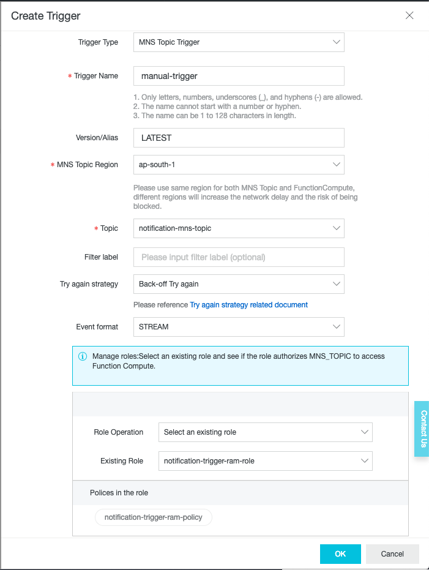
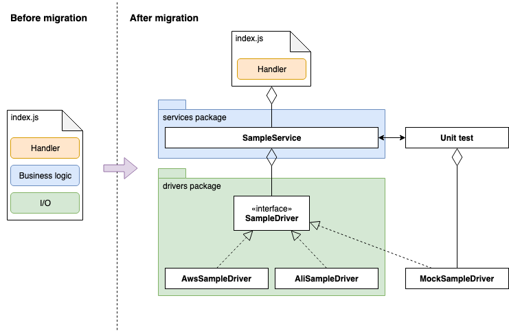
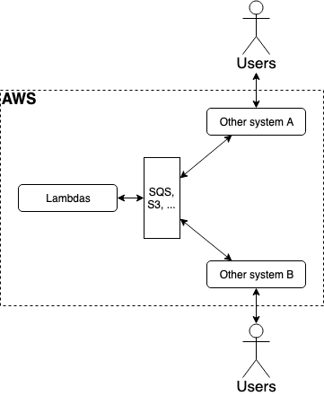
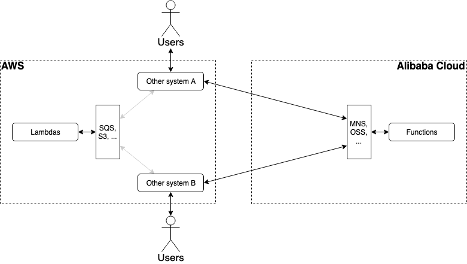
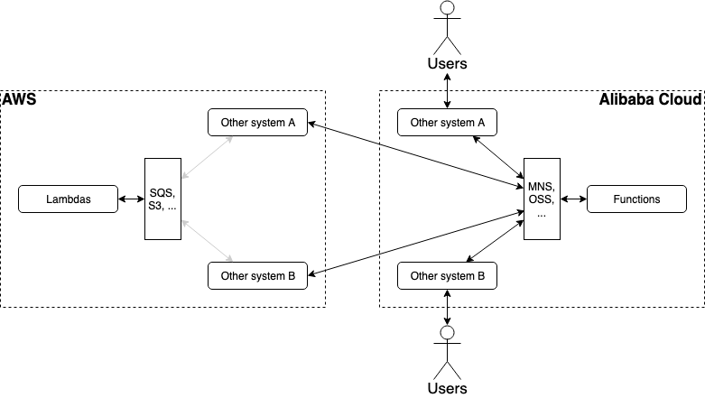

# Lambda to Function Compute migration

## Summary
1. [Introduction](#introduction)
2. [Prerequisites](#prerequisites)
3. [Examples](#examples)
    1. [Basic example](#basic-example)
    2. [Timer trigger example](#timer-trigger-example)
    3. [Object storage trigger example](#object-storage-trigger-example)
    4. [Notification trigger example](#notification-trigger-example)
    5. [Notification sending example](#notification-sending-example)
    6. [Object storage file read / write example](#object-storage-file-read--write-example)
4. [Migration methodology](#migration-methodology)
    1. [Function migration](#function-migration)
    2. [Overall migration context](#overall-migration-context)
5. [Advanced examples](#advanced-examples)
    1. [Integration with PostgreSQL](#integration-with-postgresql)
6. [Support](#support)

## Introduction
The goal of this document is to explain how to migrate a serverless application from AWS to Alibaba Cloud.

The following cloud technologies are presented:
* [AWS Lambda](https://docs.aws.amazon.com/lambda/latest/dg/welcome.html) and 
  [Alibaba Cloud Function Compute](https://www.alibabacloud.com/products/function-compute)
* [AWS SQS](https://aws.amazon.com/sqs/) and [Alibaba Cloud MNS](https://www.alibabacloud.com/product/message-service)
* [AWS S3](https://aws.amazon.com/s3/) and [Alibaba Cloud OSS](https://www.alibabacloud.com/product/oss)

Both Lambda and Function Compute support the Node.js v8.x (LTS) runtime. For example the following function works
on both platforms:
```javascript
exports.handler = function (event, context, callback) { 
  console.log('hello world');
  console.log(process.version);
  callback(null, 'hello world');
};
```
This is great because the code that deals with business logic can be copied from one technology to another. However
there are many differences:
* The signature of the `handler` function is different:
  * On AWS, `event` and `context` are both
    [Objects](https://developer.mozilla.org/en-US/docs/Web/JavaScript/Reference/Global_Objects/Object).
  * On Alibaba Cloud, `event` is a [Buffer](https://nodejs.org/docs/latest-v8.x/api/buffer.html) and `context` is an
    [Object](https://developer.mozilla.org/en-US/docs/Web/JavaScript/Reference/Global_Objects/Object).
  * Both `event` and `context` contain different data and are structured differently.
  * Fortunately the `callback` parameter has the same signature on both platforms
    (`function(error: Error?, result: Object?)` in [JSDoc format](http://usejsdoc.org/)).
* APIs / SDKs for services such as SQS / MNS or S3 / OSS are different (service features are also different).
* [Triggers](https://foobar123.com/how-to-trigger-event-driven-aws-lambda-a262bf8b60d0) are different and
  the `event` parameter they generate are structured differently.

> Note: from this observation we can already get some ideas about how to migrate an existing code base from AWS
> to Alibaba Cloud: by first decoupling the code that deals with business logic from the one that deals with
> [I/O](https://en.wikipedia.org/wiki/Input/output), then by reimplementing the I/O code. More on this subject can be
> found in the [Migration methodology section](#migration-methodology).

There are many other differences between the two [FAAS](https://en.wikipedia.org/wiki/Function_as_a_service) platforms:
* [AWS environment variables and Linux system](https://docs.aws.amazon.com/lambda/latest/dg/current-supported-versions.html)
  vs [Alibaba Cloud execution environment](https://www.alibabacloud.com/help/doc-detail/59223.htm)
* [Limits (AWS)](https://docs.aws.amazon.com/lambda/latest/dg/limits.html) vs
  [Limits (Alibaba Cloud)](https://www.alibabacloud.com/help/doc-detail/51907.htm)
* Node.js runtime version:
  [v8.10.0 (AWS) vs v8.9.0 (Alibaba Cloud)](https://github.com/nodejs/node/blob/master/doc/changelogs/CHANGELOG_V8.md#8.10.0)
* [AWS Lambda handler](https://docs.aws.amazon.com/lambda/latest/dg/nodejs-prog-model-handler.html) vs
  [Alibaba Cloud Function Compute handler](https://www.alibabacloud.com/help/doc-detail/74757.htm).
* [AWS Logging](https://docs.aws.amazon.com/lambda/latest/dg/nodejs-prog-model-logging.html) vs
  [Alibaba Cloud Logging](https://www.alibabacloud.com/help/doc-detail/58011.htm).
* [AWS Error handling](https://docs.aws.amazon.com/lambda/latest/dg/nodejs-prog-mode-exceptions.html) vs
  [Alibaba Cloud Error handling](https://www.alibabacloud.com/help/doc-detail/52736.htm).
* AWS provide the [SAM framework](https://docs.aws.amazon.com/lambda/latest/dg/serverless_app.html) to build
  serverless applications. Alibaba Cloud provides the
  [Fun framework](https://www.alibabacloud.com/help/doc-detail/64204.htm) but with a documentation mostly in Chinese.

AWS Lambda, probably because it came first, is generally more mature and more feature-rich than
Function Compute. For example, the following features are only supported by AWS:
* [Layers](https://docs.aws.amazon.com/lambda/latest/dg/configuration-layers.html)
* [Dead Letter Queues](https://docs.aws.amazon.com/lambda/latest/dg/dlq.html)

> Note: This [interesting article](https://cloudonaut.io/comparing-serverless-offerings-from-alibaba-cloud-and-aws/)
> describes a feature comparison between AWS and Alibaba Cloud offering.

## Prerequisites
In order to run the examples, you will need an
[AWS account](https://aws.amazon.com/premiumsupport/knowledge-center/create-and-activate-aws-account/?nc1=h_ls) and an
[Alibaba Cloud one](https://www.alibabacloud.com/help/doc-detail/50482.htm).

The examples use [Terraform](https://www.terraform.io/), a tool that allows us to
[describe cloud resources with scripts](https://en.wikipedia.org/wiki/Infrastructure_as_code) and to create / destroy
them on the cloud platform. Terraform has many advantages:
* It is compatible with both AWS and Alibaba Cloud.
* It allows us to build the exact same cloud infrastructure by using the same scripts.
* It helps us saving money thanks to its [destroy command](https://www.terraform.io/docs/commands/destroy.html).

If you don’t know this tool, please follow [this tutorial](https://www.terraform.io/intro/getting-started/install.html)
and familiarize yourself with the [alicloud provider](https://www.terraform.io/docs/providers/alicloud/index.html).

In order to authenticate itself to the cloud API servers, Terraform need access keys. You need to have ones for
both your [AWS](https://aws.amazon.com/premiumsupport/knowledge-center/create-access-key/?nc1=h_ls) and
[Alibaba Cloud](https://www.alibabacloud.com/help/faq-detail/63482.htm) accounts.

Finally you also need [NPM](https://www.npmjs.com/get-npm) installed on your computer.

## Examples
This section describes examples that implement the same use cases on both AWS and Alibaba Cloud.

### Basic example
The first example consists in creating a simple function that prints "hello world" and the Node.js version.

> Note: the example files are available [here](samples/basic).

Open a terminal and execute the following commands:
```bash
# Navigate to the folder containing the first example
cd ~/projects/lambda-to-function-compute-migration/samples/basic/

# Let's start with AWS
cd aws

export AWS_ACCESS_KEY_ID="your access key id"
export AWS_SECRET_ACCESS_KEY="your access key secret"
export AWS_DEFAULT_REGION="ap-south-1" # Mumbai

# Package the application
sh package-lambda.sh

# Initialize Terraform and create the cloud resources
terraform init
terraform apply

# Let's continue with Alibaba Cloud
cd ../alibabacloud

export ALICLOUD_ACCESS_KEY="your access key id"
export ALICLOUD_SECRET_KEY="your access key secret"
export ALICLOUD_REGION="ap-south-1" # Mumbai

# Package the application
sh package-function.sh

# Initialize Terraform and create the cloud resources
terraform init
terraform apply
```
> Note: as you can see, creating the cloud resources on AWS and Alibaba Cloud is very simple thanks to Terraform.

The function source code is exactly the same on both cloud platforms:
```javascript
exports.handler = function (event, context, callback) {
    console.log('hello world');
    console.log(process.version);
    callback(null, 'hello world');
};
```
It simply prints 'hello world' and the Node.js version in the logs, and returns the 'hello world' response.

However, the Terraform scripts are quite different. Here are the simplified and commented scripts:
* [main.tf script for AWS](samples/basic/aws/main.tf):

    ```hcl-terraform
    // Tell Terraform to use the AWS provider
    provider "aws" { /* ... */ }

    // Mandatory minimal IAM role for a lambda
    resource "aws_iam_role" "basic_lambda_role" {
      name = "basic_lambda_role"
    
      assume_role_policy = <<EOF
    {
      "Version": "2012-10-17",
      "Statement": [
        {
          "Action": "sts:AssumeRole",
          "Principal": {
            "Service": "lambda.amazonaws.com"
          },
          "Sid": "",
          "Effect": "Allow"
        }
      ]
    }
    EOF
    }
    
    // Lambda
    resource "aws_lambda_function" "basic_lambda" {
      filename = "target/basic.zip"
      function_name = "basic"
      role = "${aws_iam_role.basic_lambda_role.arn}"
      runtime = "nodejs8.10"
      /* ... */
    }
    
    // Log group that allows us to store logs
    resource "aws_cloudwatch_log_group" "basic_log_group" {
      name = "/aws/lambda/basic"
      /* ... */
    }
    
    // Policy and role to allow the lambda to write logs into the log group
    resource "aws_iam_policy" "basic_logging_policy" {
      name = "basic_lambda_logging"
      path = "/"
      description = "IAM policy for logging from a lambda"
    
      policy = <<EOF
    {
      "Version": "2012-10-17",
      "Statement": [
        {
          "Action": [
            "logs:CreateLogStream",
            "logs:PutLogEvents"
          ],
          "Resource": "arn:aws:logs:ap-south-1:account_id:log-group:/aws/lambda/basic:*",
          "Effect": "Allow"
        }
      ]
    }
    EOF
    }
    resource "aws_iam_role_policy_attachment" "basic_logging_policy_attachment" {
      role = "${aws_iam_role.basic_lambda_role.name}"
      policy_arn = "${aws_iam_policy.basic_logging_policy.arn}"
    }
    ```
    
* [main.tf script for Alibaba Cloud](samples/basic/alibabacloud/main.tf):

    ```hcl-terraform
    // Tell Terraform to use the AWS provider
    provider "alicloud" { /* ... */ }
    
    // Create a log project and store to allow us to store logs
    resource "alicloud_log_project" "basic_log_project" {
      name = "basic-log-project"
    }
    resource "alicloud_log_store" "basic_log_store" {
      project = "${alicloud_log_project.basic_log_project.name}"
      name = "basic-log-store"
    }
    
    // Role and policy that allow the function to print logs into the log store
    resource "alicloud_ram_role" "basic_service_role" {
      name = "basic-service-role"
      services = [
        "fc.aliyuncs.com"
      ]
    }
    resource "alicloud_ram_policy" "basic_service_policy" {
      name = "basic-service-policy"
    
      statement = [
        {
          effect = "Allow"
          action = [
            "log:PostLogStoreLogs"
          ]
    
          resource = [
            "acs:log:ap-south-1:account_id:project/basic-log-project/logstore/basic-log-store",
          ]
        }
      ]
    }
    resource "alicloud_ram_role_policy_attachment" "basic_policy_attachment" {
      policy_name = "${alicloud_ram_policy.basic_service_policy.name}"
      policy_type = "${alicloud_ram_policy.basic_service_policy.type}"
      role_name = "${alicloud_ram_role.basic_service_role.name}"
    }
    
    // Service that can regroup one or more functions
    resource "alicloud_fc_service" "basic_service" {
      name = "basic_service"
    
      role = "${alicloud_ram_role.basic_service_role.arn}"
    
      log_config = {
        project = "${alicloud_log_project.basic_log_project.name}"
        logstore = "${alicloud_log_store.basic_log_store.name}"
      }
    
      depends_on = [
        "alicloud_ram_role_policy_attachment.basic_policy_attachment"
      ]
    }
    
    // Function
    resource "alicloud_fc_function" "basic_function" {
      service = "${alicloud_fc_service.basic_service.name}"
      filename = "target/basic.zip"
      name = "basic"
      handler = "index.handler"
      runtime = "nodejs8"
    }
    ```

As you can see, the Terraform scripts reveals many supporting services that allows Lambdas / Functions to run in
the cloud:
* Logs are stored into a
  [CloudWatch log group on AWS](https://docs.aws.amazon.com/AmazonCloudWatch/latest/logs/CloudWatchLogsConcepts.html)
  and a [Log Service group and store on Alibaba Cloud](https://www.alibabacloud.com/help/doc-detail/28961.htm).
* In Alibaba Cloud, functions are grouped into [services](https://www.alibabacloud.com/help/doc-detail/74925.htm).
* In Alibaba Cloud, roles are attached to services instead of functions (unlike with AWS).
* Users, roles and policies are managed by [IAM on AWS](https://aws.amazon.com/iam/) and
  [RAM on Alibaba Cloud](https://www.alibabacloud.com/product/ram).

You can manually invoke the lambda / function from the
[AWS web console](https://ap-south-1.console.aws.amazon.com/lambda/) or the
[Alibaba Cloud one](https://fc.console.aliyun.com), then check the results in the logs.

When you are done, you can release the cloud resources with the following commands:
```bash
# Navigate to the folder containing the first example
cd ~/projects/lambda-to-function-compute-migration/samples/basic/

# Destroy AWS resources
cd aws
terraform destroy

# Destroy Alibaba Cloud resources
cd ../alibabacloud
terraform destroy
```

### Timer trigger example
In this example we trigger a function every 5 minutes. In order to achieve this goal, we use
[CloudWatch events with AWS](https://docs.aws.amazon.com/AmazonCloudWatch/latest/events/WhatIsCloudWatchEvents.html)
and a [Timer trigger with Alibaba Cloud](https://www.alibabacloud.com/help/doc-detail/68172.htm).

> Note: the example files are available [here](samples/trigger_timer).

To install this example, please follow the same commands as the ones described in the
[Basic example section](#basic-example) but from the `/samples/trigger_timer/` folder.

The functions are very similar:
* On AWS:

    ```javascript
    exports.handler = function (event, context, callback) {
        console.log('Function invoked at: ' + new Date());
        console.log('Event: ' + JSON.stringify(event));
        callback(null, 'success');
    };
    ```

* On Alibaba Cloud:

    ```javascript
    exports.handler = function (event, context, callback) {
        console.log('Function invoked at: ' + new Date());
        console.log('Event: ' + event.toString());
        callback(null, 'success');
    };
    ```
    > Note: the `toString()` method is documented
    > [here](https://nodejs.org/api/buffer.html#buffer_buf_tostring_encoding_start_end).

The Terraform scripts are very similar to the [Basic example](#basic-example):
* On AWS we add a CloudWatch event rule & target, and a permission to invoke the lambda:

    ```hcl-terraform
    // ... similar code as the basic example ...
    
    resource "aws_cloudwatch_event_rule" "timer_event_rule" {
      name = "timer_event_rule"
      schedule_expression = "rate(5 minutes)"
      /* ... */
    }
    
    resource "aws_cloudwatch_event_target" "timer_event_target" {
      target_id = "timer_event_target"
      rule = "${aws_cloudwatch_event_rule.timer_event_rule.name}"
      arn = "${aws_lambda_function.timer_lambda.arn}"
    }
    
    resource "aws_lambda_permission" "allow_cloudwatch_to_call_check_foo" {
      statement_id = "AllowExecutionFromCloudWatch"
      action = "lambda:InvokeFunction"
      function_name = "${aws_lambda_function.timer_lambda.function_name}"
      principal = "events.amazonaws.com"
      source_arn = "${aws_cloudwatch_event_rule.timer_event_rule.arn}"
    }
    ```

* On Alibaba Cloud we just add a timer trigger:

    ```hcl-terraform
    // ... similar code as the basic example ...
  
    resource "alicloud_fc_trigger" "timer_fc_trigger" {
      name = "timer-fc-trigger"
      service = "${alicloud_fc_service.timer_service.name}"
      function = "${alicloud_fc_function.timer_function.name}"
      type = "timer"
    
      config = <<EOF
        {
            "payload": "some-custom-payload",
            "cronExpression": "@every 5m",
            "enable": true
        }
      EOF
    }
    ```
    > Note: the timer trigger is actually simpler to setup than a CloudWatch event rule, and we can even specify a
    > custom payload.

However, the `event` parameters is completely different on AWS and Alibaba Cloud:
* On AWS the `event` object contains:

    ```json
    {
      "version": "0",
      "id": "f4cb2b21-6b4c-1d0b-f854-03e9d0dd0328",
      "detail-type": "Scheduled Event",
      "source": "aws.events",
      "account": "220420460675",
      "time": "2019-03-29T05:56:24Z",
      "region": "ap-south-1",
      "resources": [
        "arn:aws:events:ap-south-1:220420460675:rule/timer_event_rule"
      ],
      "detail": {}
    }
    ```
* On Alibaba Cloud the `event` buffer contains:

    ```json
    {
      "triggerTime": "2019-03-29T06:41:57Z",
      "triggerName": "timer-fc-trigger",
      "payload": "some-custom-payload"
    }
    ```
    > Note: the "some-custom-payload" is defined in the Terraform script.

### Object storage trigger example
In this example we trigger a function when a file is created on a
[S3](https://docs.aws.amazon.com/AmazonS3/latest/dev/UsingBucket.html) /
[OSS](https://www.alibabacloud.com/help/doc-detail/31827.htm) bucket. In order to achieve this goal, we use a
[S3 event notification on AWS](https://docs.aws.amazon.com/AmazonS3/latest/dev/NotificationHowTo.html)
and an [OSS event trigger with Alibaba Cloud](https://www.alibabacloud.com/help/doc-detail/62922.htm).

> Note: the example files are available [here](samples/trigger_object_storage).

To install this example, please follow the same commands as the ones described in the
[Basic example section](#basic-example) but from the `/samples/trigger_object_storage/` folder.

The functions are very similar:
* On AWS:

    ```javascript
    exports.handler = function (event, context, callback) {
        console.log('Event: ' + JSON.stringify(event));
        callback(null, 'success');
    };
    ```

* On Alibaba Cloud:

    ```javascript
    exports.handler = function (event, context, callback) {
        const ossEvent = JSON.parse(event);
        console.log('Event: ' + JSON.stringify(ossEvent));
        callback(null, 'success');
    };
    ```

The Terraform scripts are similar to the [Basic example](#basic-example):
* On AWS we add a bucket, a bucket notification and a permission:

    ```hcl-terraform
    // ... similar code as the basic example ...
    
    resource "aws_s3_bucket" "storage_bucket" {
      bucket_prefix = "storage-bucket"
    }
    
    resource "aws_lambda_permission" "storage_permission" {
      statement_id = "AllowExecutionFromS3Bucket"
      action = "lambda:InvokeFunction"
      function_name = "${aws_lambda_function.storage_lambda.arn}"
      principal = "s3.amazonaws.com"
      source_arn = "${aws_s3_bucket.storage_bucket.arn}"
    }
    
    resource "aws_s3_bucket_notification" "storage_notification" {
      bucket = "${aws_s3_bucket.storage_bucket.id}"
    
      lambda_function {
        lambda_function_arn = "${aws_lambda_function.storage_lambda.arn}"
        events = [
          "s3:ObjectCreated:*"
        ]
      }
    }
    ```

* On Alibaba Cloud we add a bucket, an oss trigger and a role attached to the trigger (to invoke the function):

    ```hcl-terraform
    // ... similar code as the basic example ...
  
    resource "alicloud_oss_bucket" "storage_bucket" {
      bucket = "storage-bucket-20190329"
    }

    // Role attached to the trigger
    resource "alicloud_ram_role" "storage_trigger_ram_role" {
      name = "storage-trigger-ram-role"
      services = [
        "oss.aliyuncs.com"
      ]
    }
    resource "alicloud_ram_policy" "storage_trigger_ram_policy" {
      name = "storage-trigger-ram-policy"
    
      statement = [
        {
          effect = "Allow"
          action = [
            "fc:InvokeFunction"
          ]
    
          resource = [
            "acs:fc:ap-south-1:account_id:services/${alicloud_fc_service.storage_service.name}/functions/*",
            "acs:fc:ap-south-1:account_id:services/${alicloud_fc_service.storage_service.name}.*/functions/*"
          ]
        }
      ]
    }
    resource "alicloud_ram_role_policy_attachment" "storage_trigger_policy_attachment" {
      policy_name = "${alicloud_ram_policy.storage_trigger_ram_policy.name}"
      policy_type = "${alicloud_ram_policy.storage_trigger_ram_policy.type}"
      role_name = "${alicloud_ram_role.storage_trigger_ram_role.name}"
    }
    
    // Trigger
    resource "alicloud_fc_trigger" "storage_fc_trigger" {
      name = "storage-fc-trigger"
      service = "${alicloud_fc_service.storage_service.name}"
      function = "${alicloud_fc_function.storage_function.name}"
      type = "oss"
      source_arn = "acs:oss:ap-south-1:account_id:storage-bucket-20190329"
      role = "${alicloud_ram_role.storage_trigger_ram_role.arn}"
    
      config = <<EOF
        {
            "events": ["oss:ObjectCreated:*"]
        }
      EOF
    }
    ```

> Note: in both scripts, the S3 / OSS event names are similar (e.g. `s3:ObjectCreated:*` vs `oss:ObjectCreated:*`).
> In addition, with AWS we can specify a `bucket_prefix` instead of a `bucket` attribute: this is convenient
> because bucket names must be unique across accounts, and a `bucket_prefix` allows us to make sure we have a unique
> bucket name.

Fortunately, unlike the [previous example](#timer-trigger-example), the `event` parameters are quite similar on AWS
and Alibaba Cloud:
* On AWS the `event` object contains:

    ```json
    {
      "Records": [
        {
          "eventVersion": "2.1",
          "eventSource": "aws:s3",
          "awsRegion": "ap-south-1",
          "eventTime": "2019-03-29T08:07:41.393Z",
          "eventName": "ObjectCreated:Put",
          "userIdentity": {
            "principalId": "AWS:AIDAINSMNFDHFPJLOE2T4"
          },
          "requestParameters": {
            "sourceIPAddress": "42.120.75.148"
          },
          "responseElements": {
            "x-amz-request-id": "145F062D51E149AF",
            "x-amz-id-2": "FwazoQvcB2IqqinmMjigPfkSgbfpo051q6KAqhiN0u2Kb81/4pmHpohZKxdPY4knn0WeBtnq2B4="
          },
          "s3": {
            "s3SchemaVersion": "1.0",
            "configurationId": "tf-s3-lambda-20190329072203278800000002",
            "bucket": {
              "name": "storage-bucket20190329072127281200000001",
              "ownerIdentity": {
                "principalId": "A20AKYX319BJRU"
              },
              "arn": "arn:aws:s3:::storage-bucket20190329072127281200000001"
            },
            "object": {
              "key": "test.txt",
              "size": 15,
              "eTag": "032447899e6c18dd3e30388764c0ff21",
              "sequencer": "005C9DD24D544E2553"
            }
          }
        }
      ]
    }
    ```
* On Alibaba Cloud the `event` buffer contains:

    ```json
    {
      "events": [
        {
          "eventName": "ObjectCreated:PostObject",
          "eventSource": "acs:oss",
          "eventTime": "2019-03-29T14:40:11.000Z",
          "eventVersion": "1.0",
          "oss": {
            "bucket": {
              "arn": "acs:oss:ap-south-1:5939306421830868:storage-bucket-20190329",
              "name": "storage-bucket-20190329",
              "ownerIdentity": "5939306421830868",
              "virtualBucket": ""
            },
            "object": {
              "deltaSize": 15,
              "eTag": "032447899E6C18DD3E30388764C0FF21",
              "key": "test.txt",
              "size": 15
            },
            "ossSchemaVersion": "1.0",
            "ruleId": "a11caf7c7e1ea63469d03b89abce96240dd95203"
          },
          "region": "ap-south-1",
          "requestParameters": {
            "sourceIPAddress": "218.72.70.27"
          },
          "responseElements": {
            "requestId": "5C9E2E4B61E5D16D23E9CEC6"
          },
          "userIdentity": {
            "principalId": "5939306421830868"
          }
        }
      ]
    }
    ```

### Notification trigger example
In this example we trigger a function when a message is received via
[SQS](https://aws.amazon.com/sqs/) / [MNS](https://www.alibabacloud.com/product/message-service).

Unfortunately there is currently no exact alternative to
[SQS event sources](https://docs.aws.amazon.com/lambda/latest/dg/with-sqs.html) in Alibaba Cloud. Instead, the closest
alternative is to use [MNS topic triggers](https://www.alibabacloud.com/help/doc-detail/97032.htm).
> Note: MNS topics corresponds to [SNS in AWS](https://docs.aws.amazon.com/sns/latest/dg/sns-lambda-as-subscriber.html).

In order to achieve this goal, we use an
[event source mapping with AWS](https://docs.aws.amazon.com/lambda/latest/dg/with-sqs.html)
and a [MNS topic trigger with Alibaba Cloud](https://www.alibabacloud.com/help/doc-detail/97032.htm).

> Note: the example files are available [here](samples/trigger_notification).

To install this example, please follow the same commands as the ones described in the
[Basic example section](#basic-example) but from the `/samples/trigger_notification/` folder.

Unfortunately, there is an additional manual step with Alibaba Cloud because the `alicloud_fc_trigger` resource
doesn't support MNS topics yet:
1. After running the `terraform apply` command, go to the [Function Compute web console](https://fc.console.aliyun.com).
2. Navigate to the "notification_service", the "notification" function and click on the "Triggers" tab.
3. Click on the "Create Trigger" button and fill the form like in the following screenshot:

    

4. Click on the "OK" button to confirm.

> Note: Don't forget to manually delete this trigger from the web console before executing the `terraform destroy`
> command.

The functions are very similar:
* On AWS:

    ```javascript
    exports.handler = function (event, context, callback) {
        console.log('Event: ' + JSON.stringify(event));
        callback(null, 'success');
    };
    ```

* On Alibaba Cloud:

    ```javascript
    exports.handler = function (event, context, callback) {
        const mnsEvent = JSON.parse(event);
        console.log('Event: ' + JSON.stringify(mnsEvent));
        callback(null, 'success');
    };
    ```

The Terraform scripts are similar to the [Basic example](#basic-example):
* On AWS we add a SQS queue, an event source mapping and a policy to enable the lambda to poll messages from SQS:

    ```hcl-terraform
    // ... similar code as the basic example ...
    
    resource "aws_sqs_queue" "notification_queue" {
      name = "notification-queue"
    }

    resource "aws_lambda_event_source_mapping" "notification_event_source_mapping" {
      batch_size = 10
      event_source_arn = "${aws_sqs_queue.notification_queue.arn}"
      enabled = true
      function_name = "${aws_lambda_function.notification_lambda.arn}"
    }
    
    resource "aws_iam_policy" "notification_sqs_policy" {
      name = "notification_lambda_sqs"
      path = "/"
      description = "IAM policy for reading messages from SQS."
    
      policy = <<EOF
    {
      "Version": "2012-10-17",
      "Statement": [
        {
          "Action": [
            "sqs:ChangeMessageVisibility",
            "sqs:DeleteMessage",
            "sqs:GetQueueAttributes",
            "sqs:ReceiveMessage"
          ],
          "Resource": "${aws_sqs_queue.notification_queue.arn}",
          "Effect": "Allow"
        }
      ]
    }
    EOF
    }
    resource "aws_iam_role_policy_attachment" "notification_sqs_policy_attachment" {
      role = "${aws_iam_role.notification_lambda_role.name}"
      policy_arn = "${aws_iam_policy.notification_sqs_policy.arn}"
    }
    ```

* On Alibaba Cloud we add a MNS topic, we prepare a role for the trigger, but unfortunately we cannot create the
  trigger there:

    ```hcl-terraform
    // ... similar code as the basic example ...
  
    resource "alicloud_mns_topic" "notification_mns_topic" {
      name = "notification-mns-topic"
    }

    // Role for the trigger (that we need to create manually with the web console)
    resource "alicloud_ram_role" "notification_trigger_ram_role" {
      name = "notification-trigger-ram-role"
      services = [
        "mns.aliyuncs.com"
      ]
    }
    resource "alicloud_ram_policy" "notification_trigger_ram_policy" {
      name = "notification-trigger-ram-policy"
    
      statement = [
        {
          effect = "Allow"
          action = [
            "fc:InvokeFunction"
          ]
    
          resource = [
            "acs:fc:ap-south-1:220420460675:services/${alicloud_fc_service.notification_service.name}/functions/*",
            "acs:fc:ap-south-1:220420460675:services/${alicloud_fc_service.notification_service.name}.*/functions/*"
          ]
        }
      ]
    }
    resource "alicloud_ram_role_policy_attachment" "notification_trigger_policy_attachment" {
      policy_name = "${alicloud_ram_policy.notification_trigger_ram_policy.name}"
      policy_type = "${alicloud_ram_policy.notification_trigger_ram_policy.type}"
      role_name = "${alicloud_ram_role.notification_trigger_ram_role.name}"
    }
    ```

Unfortunately, as we expect the `event` parameters are completely different on AWS and Alibaba Cloud:
* On AWS the `event` object contains:

    ```json
    {
      "Records": [
        {
          "messageId": "23d47066-cd46-47a8-819d-f97bc9c2abce",
          "receiptHandle": "AQEBXkIza0Az/uw6afwbmn5NGC6i7OIK7Z9BLUzkWBOApgB13YEFGU5MK4DClEgHy6eF6cxuhJKoElqHNoIgMdZTdLOWDRUW4tl1+prcpD4FrYQ+PM20PvbJETDUpUipHhEm+r5DA0+/TsqZh4iW+3Zj5NE3YUXbXP/yAiNSmzdZhCPRqMRdAHEt0AKI/rqkvhhUaJ2Xm8ODXx1xDYB6CY/ipxSTLt2ccw0/dT38yj4jxZSafhTvVgpluN7MWmDgvrMmDuQKnz7UMSBZgVI/VHAW/W8NQORxoIsW05G+SjfdgG5VxBVErHPuTkCQECGDvVqOs3IftHaFCp/1zo+sCVdEz4ub3+Nv8KxTvJ9+KB6XcOV1h2INRkn8sa1vbuKmgk8cDfjasacM9LZISxHk0CquOQ==",
          "body": "Sample content.",
          "attributes": {
            "ApproximateReceiveCount": "1",
            "SentTimestamp": "1554088217716",
            "SenderId": "AIDAINSMNFDHFPJLOE2T4",
            "ApproximateFirstReceiveTimestamp": "1554088217721"
          },
          "messageAttributes": {
            "sample-attribute": {
              "stringValue": "sample-value",
              "stringListValues": [],
              "binaryListValues": [],
              "dataType": "String"
            }
          },
          "md5OfMessageAttributes": "7c815262be77a62f56671125069ca888",
          "md5OfBody": "b58e1d0a86521415d25b85b89f6ad6cd",
          "eventSource": "aws:sqs",
          "eventSourceARN": "arn:aws:sqs:ap-south-1:220420460675:notification-queue",
          "awsRegion": "ap-south-1"
        }
      ]
    }
    ```
    > Note: we can received several messages in one lambda call.
    
* On Alibaba Cloud the `event` buffer contains:

    ```json
    {
      "TopicOwner": "5939306421830868",
      "Message": "Sample content.",
      "Subscriber": "5939306421830868",
      "PublishTime": 1554100259139,
      "SubscriptionName": "manual-trigger-8854ec3c",
      "MessageMD5": "B58E1D0A86521415D25B85B89F6AD6CD",
      "TopicName": "notification-mns-topic",
      "MessageId": "0BC20AA75F1F3D4EAC69031D69432ECE"
    }
    ```
    > Note: unlike with SQS, there is no "messageAttributes" parameter, only a "Message".

### Notification sending example
In this example we send a message to a [SQS queue](https://aws.amazon.com/sqs/) on AWS and to a
[MNS queue / topic](https://www.alibabacloud.com/product/message-service) on Alibaba Cloud.

> Note: the example files are available [here](samples/output_notification).

On AWS, the lambda uses the [Node.js SDK](https://aws.amazon.com/sdk-for-node-js/):
```javascript
const AWS = require('aws-sdk');

exports.handler = function (event, context, callback) {
    const sqs = new AWS.SQS({apiVersion: '2012-11-05'});

    const params = {
        DelaySeconds: 10,
        MessageAttributes: {
            'sample-attribute': {
                DataType: 'String',
                StringValue: 'sample-value'
            }
        },
        MessageBody: 'Sample content',
        QueueUrl: process.env.queueUrl
    };

    console.log('Sending a message...');
    sqs.sendMessage(params, (err, data) => {
        if (err) {
            console.log('Unable to send the message.', err);
            callback(err);
        } else {
            console.log(`Message sent with success (${data.MessageId})!`);
            callback(null, data.MessageId);
        }
    });
};
```

On AWS, the SDK is already installed in the lambda runtime environment, so we don't need to package it. However, this
is not the case for MNS: we need to package an [external MNS SDK](https://github.com/aliyun/mns-nodejs-sdk) with
[NPM](https://www.npmjs.com/get-npm).
    
The following function sends two messages: one to a MNS topic, and another one to a MNS queue.
```javascript
const MNSClient = require('@alicloud/mns');

exports.handler = async function (event, context, callback) {
    const mnsClient = new MNSClient(context.accountId, {
        region: context.region,
        accessKeyId: context.credentials.accessKeyId,
        accessKeySecret: context.credentials.accessKeySecret,
        securityToken: context.credentials.securityToken
    });

    console.log('Sending a sample message to a topic...');
    try {
        const result = await mnsClient.publishMessage(process.env.topicName, {MessageBody: 'sample-content'});
        console.log(`Message sent to the topic with success! (result = ${JSON.stringify(result)})`);
    } catch (error) {
        console.log('Unable to send the message to the topic.', error);
        callback(error);
    }

    console.log('Sending a sample message to a queue...');
    try {
        const result = await mnsClient.sendMessage(process.env.queueName, {MessageBody: 'sample-content'});
        console.log(`Message sent to the queue with success! (result = ${JSON.stringify(result)})`);
    } catch (error) {
        console.log('Unable to send the message to the queue.', error);
        callback(error);
    }

    callback(null);
};
```
> Note: the authentication mechanisms differs on AWS and Alibaba Cloud. On AWS there is no need to provide
> an access key since the lambda runtime system does it for us. On Alibaba Cloud we need to pass an access key and
> a [STS / security token](https://www.alibabacloud.com/help/doc-detail/66222.htm).


The Terraform scripts are quite different between AWS and Alibaba Cloud:
* On AWS we create a SQS queue, a policy to send messages and we pass the queue URL to the lambda:

    ```hcl-terraform
    // ... provider and minimal IAM role ...
    
    // Here we pass the queue URL to the lamba as an environment variable
    resource "aws_lambda_function" "outnotification_lambda" {
      /* ... */
    
      environment = {
        variables = {
          queueUrl = "https://sqs.ap-south-1.amazonaws.com/account_id/${aws_sqs_queue.outnotification_queue.name}"
        }
      }
    }
    
    // ... log group and IAM policy ...
    
    resource "aws_sqs_queue" "outnotification_queue" {
      name = "outnotification-queue"
    }
    
    // Policy to allow the lambda to send message to the SQS queue
    resource "aws_iam_policy" "outnotification_sqs_policy" {
      name = "outnotification_lambda_sqs"
      path = "/"
      description = "IAM policy for sending messages to SQS."
    
      policy = <<EOF
    {
      "Version": "2012-10-17",
      "Statement": [
        {
          "Action": [
            "sqs:SendMessage"
          ],
          "Resource": "${aws_sqs_queue.outnotification_queue.arn}",
          "Effect": "Allow"
        }
      ]
    }
    EOF
    }
    
    // ...
    ```

* On Alibaba Cloud we create a MNS topic, a MNS queue, policies to send messages to the topic and queue, and we pass
  the topic and queue names to the function:

    ```hcl-terraform
    // ... provider, log project / store and a RAM role to allow the function to print logs ...

    resource "alicloud_mns_topic" "outnotification_mns_topic" {
      name = "outnotification-mns-topic"
    }
    
    // Policy to allow the function to send messages to the MNS topic
    resource "alicloud_ram_policy" "outnotification_topic_policy" {
      name = "outnotification-topic-policy"
    
      statement = [
        {
          effect = "Allow"
          action = [
            "mns:PublishMessage"
          ]
    
          resource = [
            "acs:mns:ap-south-1:account_id:/topics/${alicloud_mns_topic.outnotification_mns_topic.name}/messages",
          ]
        }
      ]
    }
    
    // ...

    resource "alicloud_mns_queue" "outnotification_mns_queue" {
      name = "outnotification-mns-queue"
    }
    
    // Policy to allow the function to send messages to the MNS queue
    resource "alicloud_ram_policy" "outnotification_queue_policy" {
      name = "outnotification-queue-policy"
    
      statement = [
        {
          effect = "Allow"
          action = [
            "mns:SendMessage"
          ]
    
          resource = [
            "acs:mns:ap-south-1:account_id:/queues/${alicloud_mns_queue.outnotification_mns_queue.name}/messages",
          ]
        }
      ]
    }
    
    // ... Function compute service ...
    
    // Here we pass the topic and queue names to the function as an environment variables
    resource "alicloud_fc_function" "outnotification_function" {
      /* ... */
    
      environment_variables = {
        topicName = "${alicloud_mns_topic.outnotification_mns_topic.name}",
        queueName = "${alicloud_mns_queue.outnotification_mns_queue.name}"
      }
    }
    ```

### Object storage file read / write example
In this example we read and write a file on a [S3](https://docs.aws.amazon.com/AmazonS3/latest/dev/UsingBucket.html) /
[OSS](https://www.alibabacloud.com/help/doc-detail/31827.htm) bucket.

> Note: the example files are available [here](samples/output_object_storage).

The functions are similar:
* On AWS:

    ```javascript
    const AWS = require('aws-sdk');
    
    exports.handler = async (event, context, callback) => {
        const s3 = new AWS.S3();
    
        // Read a file
        console.log('Read the test file...');
        let getObjectResponse;
        try {
            getObjectResponse = await s3.getObject({
                Bucket: process.env.bucketName,
                Key: 'test.txt'
            }).promise();
        } catch (error) {
            console.log('Unable to read the test file.', error);
            callback(error);
        }
        console.log(`Test file read with success (body = ${getObjectResponse.Body.toString()})!`);
    
        // Write a file
        console.log('Write a new test file...');
        let putObjectResponse;
        try {
            putObjectResponse = await s3.putObject({
                Body: Buffer.from('Sample content.', 'utf8'),
                Bucket: process.env.bucketName,
                Key: `generated_${+new Date()}.txt`
            }).promise();
        } catch (error) {
            console.log('Unable to write a test file.', error);
            callback(error);
        }
        console.log(`Test file written with success (putObject response = ${JSON.stringify(putObjectResponse)})!`);
        callback(null);
    };
    ```

* On Alibaba Cloud:

    ```javascript
    const OSS = require('ali-oss').Wrapper;
    
    exports.handler = async (event, context, callback) => {
        const ossClient = new OSS({
            region: 'oss-' + context.region,
            accessKeyId: context.credentials.accessKeyId,
            accessKeySecret: context.credentials.accessKeySecret,
            stsToken: context.credentials.securityToken,
            bucket: process.env.bucketName
        });
    
        // Read a file
        console.log('Read the test file...');
        let getObjectResponse;
        try {
            getObjectResponse = await ossClient.get('test.txt');
        } catch (error) {
            console.log('Unable to read the test file.', error);
            callback(error);
        }
        console.log(`Test file read with success (body = ${getObjectResponse.content.toString()})!`);
    
        // Write a file
        console.log('Write a new test file...');
        let putObjectResponse;
        try {
            putObjectResponse = await ossClient.put(`generated_${+new Date()}.txt`, new Buffer('Sample content.'));
        } catch (error) {
            console.log('Unable to write a test file.', error);
            callback(error);
        }
        console.log(`Test file written with success (putObject response = ${JSON.stringify(putObjectResponse)})!`);
        callback(null);
    };
    ```

> Note 1: fortunately, unlike with MNS, on both AWS and Alibaba Cloud the SDK is already installed in the runtime
> environment, so we don't have to package it with NPM.

> Note 2: like in the [previous example](#notification-sending-example), authentication mechanism differs:
> there is no need to pass an access key with AWS, but we need to provide an access key and a  STS / security token
> with Alibaba cloud.

> Note 3: there are inconsistencies between the MNS SDK and the OSS one:
> * The STS / security token parameter is called `securityToken` with MNS whereas it is called `stsToken` with OSS.
> * The region must be prefixed with "oss-" with the OSS client.

The Terraform scripts are similar to the [Basic example](#basic-example):
* On AWS we add a bucket, a bucket object (test.txt) and a IAM policy to allow the lambda to read an write files:

    ```hcl-terraform
    // ... similar code as the basic example ...
    
    resource "aws_s3_bucket" "outobjstorage_bucket" {
      bucket_prefix = "outobjstorage-bucket"
    }
    
    resource "aws_s3_bucket_object" "outobjstorage_bucket_object" {
      bucket = "${aws_s3_bucket.outobjstorage_bucket.bucket}"
      key = "test.txt"
      content = "sample-test-content"
    }
    
    resource "aws_iam_policy" "outobjstorage_bucket_policy" {
      name = "outobjstorage_lambda_bucket"
      path = "/"
      description = "IAM policy for reading and writing files on S3."
    
      policy = <<EOF
    {
      "Version": "2012-10-17",
      "Statement": [
        {
          "Action": [
            "s3:GetObject",
            "s3:PutObject"
          ],
          "Resource": "${aws_s3_bucket.outobjstorage_bucket.arn}/*",
          "Effect": "Allow"
        }
      ]
    }
    EOF
    }
    
    resource "aws_iam_role_policy_attachment" "outobjstorage_bucket_policy_attachment" {
      role = "${aws_iam_role.outobjstorage_lambda_role.name}"
      policy_arn = "${aws_iam_policy.outobjstorage_bucket_policy.arn}"
    }
    ```

* On Alibaba Cloud we add a bucket, a bucket object (test.txt) and a RAM policy to allow the lambda to read an write files:

    ```hcl-terraform
    // ... similar code as the basic example ...
  
    resource "alicloud_oss_bucket" "outobjstorage_bucket" {
      bucket = "outobjstorage-bucket-20190402"
    }
    
    resource "alicloud_oss_bucket_object" "outobjstorage_bucket_object" {
      bucket = "${alicloud_oss_bucket.outobjstorage_bucket.bucket}"
      key = "test.txt"
      content = "sample-test-content"
    }
    
    resource "alicloud_ram_policy" "outobjstorage_bucket_policy" {
      name = "outobjstorage-bucket-policy"
    
      statement = [
        {
          effect = "Allow"
          action = [
            "oss:PutObject",
            "oss:GetObject"
          ]
    
          resource = [
            "acs:oss:oss-ap-south-1:account_id:${alicloud_oss_bucket.outobjstorage_bucket.bucket}/*",
          ]
        }
      ]
    }
    
    resource "alicloud_ram_role_policy_attachment" "outobjstorage_bucket_policy_attachment" {
      policy_name = "${alicloud_ram_policy.outobjstorage_bucket_policy.name}"
      policy_type = "${alicloud_ram_policy.outobjstorage_bucket_policy.type}"
      role_name = "${alicloud_ram_role.outobjstorage_service_role.name}"
    }
    ```
    > Note: again, the region is prefixed with "oss-" in the policy that refers to the bucket resource.

## Migration methodology

### Function migration
In order to migrate lambdas from AWS to Alibaba Cloud, the following solution is recommended:

1. If the existing scripts mix business logic with I/O-related code (for example when everything is located in
    an "index.js" file), the first step is to decouple these two parts into different
    [classes](https://developer.mozilla.org/en-US/docs/Web/JavaScript/Reference/Classes):
    * Business logic code should be moved into one class. It should be completely independent from
      external services such as SQS or S3. It means that it cannot directly access to the `event` or `context`
      objects, and it cannot import modules such as `aws-sdk`.
    * I/O-related code, that communicates with external services such as SQS or S3, should be moved into one or more
      classes, each of them responsible for one particular service, for example `SqsMessagingDriver` or
      `S3ObjectStorageDriver`.
    * Because the business logic and I/O-related code have been moved into their respective classes, the `handler`
      function is now relatively small. Its responsibility is to initialize these classes by
      [injecting dependencies](https://en.wikipedia.org/wiki/Dependency_injection) (the I/O class instances should be
      passed as parameters to the business logic class constructor), and by calling the business logic class methods.
    * In order to prepare the next step, each I/O class must implement a vendor-independent
      [interface](https://blog.koalatea.io/2018/01/02/interfaces-and-abstract-classes-in-javascript-with-es6/).
      For example, `SqsMessagingDriver` must implements `MessagingDriver`, `S3ObjectStorageDriver` must implement
      `ObjectStorageDriver`. The business logic class must only call methods defined in these vendor-independent
      interfaces.

2. The second step is to add new implementations for the I/O interfaces in order to support Alibaba Cloud services.
    For example `MnsMessagingDriver` implements `MessagingDriver` and `OssObjectStorageDriver` implements
    `ObjectStorageDriver`.
    
3. The third step is to write a new `handler` method, similar to the existing one for AWS, but this time for
   Alibaba Cloud: it should initialize Alibaba Cloud-related I/O classes, and pass them to the business logic class (the
   business logic class should only use methods defined in I/O interfaces, so swapping the implementations should work).

The following diagram illustrates the steps above:



> Note: as you can see, splitting business logic from I/O management should make the code more maintainable,
> especially since it allows us to [mock](https://en.wikipedia.org/wiki/Mock_object) I/O classes in order to write
> [unit tests](https://en.wikipedia.org/wiki/Unit_testing) for the business logic class.

For practice, please have a look at [this example application](samples/thumbnailer): its goal is to create
a [thumbnail](https://en.wikipedia.org/wiki/Thumbnail) each time an image is created in the `images/` "folder" of
a S3 / OSS bucket; once the transformation is finished, the thumbnail is saved into the `thumnails/` "folder" of the same
bucket, then a message is sent to a SQS / MNS queue.

This example is composed of two versions:
* The [version 1](samples/thumbnailer/version_1) is made of a [index.js](samples/thumbnailer/version_1/src/index.js)
  script mixing business logic and I/O. It is also only compatible with AWS.
* The [version 2](samples/thumbnailer/version_2) is the result after the migration: it is compatible with both AWS
  and Alibaba Cloud. On AWS, the `handler` function of the [indexaws.js](samples/thumbnailer/version_2/src/indexaws.js)
  file is invoked. On Alibaba Cloud, the `handler` function of the
  [indexalibabacloud.js](samples/thumbnailer/version_2/src/indexalibabacloud.js) file is invoked.

### Overall migration context
In the previous section we saw how to make lambdas compatible with both AWS and Alibaba Cloud. In this section we will
see how it integrates into the overall migration context.

Let's represent the initial state of the overall system with the following diagram:



This diagram displays 3 elements:
* The lambdas on the left.
* The intermediate services (SQS, S3, ...) that let other systems to communicate with the lambdas.
* Other systems, such as monolithic web applications, databases, etc.

The first step to migrate this system to Alibaba Cloud is to make the lambdas compatible with both AWS and
Alibaba Cloud (as explained in the [previous section](#overall-migration-context)), and deploy the same code base in
both clouds.
After some testing and validations, other services can redirect their traffic to the functions in Alibaba Cloud:



> Note: in this diagram we can see that the other systems are still running on AWS. The idea is to avoid a
> "big bang approach", so we don't migrate everything at once. In addition, in case of problems, we can switch back
> the traffic to the old lambdas.

The next step is to migrate other services to Alibaba Cloud and to switch users traffic to the new cloud:



> Note: as you can see, the old system is still in place, and ready to get back users traffic in case of problems.

The last step is to remove the AWS system, in order to save money, after we are sure the migration is successful.

## Advanced examples

### Integration with PostgreSQL
This example demonstrates how to migrate an AWS lambda that communicates with
[Amazon RDS for PostgreSQL](https://aws.amazon.com/rds/postgresql/) to Alibaba Cloud. The Javascript source
code is the same for both AWS and Alibaba Cloud, the only difference is the way to setup cloud resources.

> Note: In Alibaba Cloud, the corresponding services are
> [Function Compute](https://www.alibabacloud.com/products/function-compute) and
> [ApsaraDB RDS for PostgreSQL](https://www.alibabacloud.com/product/apsaradb-for-rds-postgresql).

Let's start by the [source code](samples/output_postgresql) organization. The architecture is split in 4 layers:
* The *driver layer*, responsible for the direct communication with the database.
* The *repository layer*, that provides data operations without exposing details of the database.
  This layer corresponds to the [DAO pattern](https://en.wikipedia.org/wiki/Data_access_object).
* The *service layer*, responsible for implementing business logic.
* The *handler layer*, which is the entry point of the lambda / function. Its role is to inject dependencies between
  classes and call the services.

The source code is available [here](samples/output_postgresql). The business logic is located in the `SampleService`
class, where simple [CRUD operations](https://en.wikipedia.org/wiki/Create,_read,_update_and_delete) are executed
on a [single table](https://en.wikipedia.org/wiki/Table_(database)).

#### Prerequisites for the PostgreSQL integration sample
In order to install and configure this example, we need the following command line tools on our local machine:
* [psql](http://postgresguide.com/utilities/psql.html), a client for PostgreSQL:

    ```bash
    # Installation on MAC OSX
    brew install postgres

    # Installation on Ubuntu
    sudo apt-get install postgresql-client
    ```

* [jq](https://stedolan.github.io/jq/download/), a tool to query data from JSON documents:

    ```bash
    # Installation on MAC OSX
    brew install jq

    # Installation on Ubuntu
    sudo apt-get install jq
    ```

* [Aliyun CLI](https://github.com/aliyun/aliyun-cli), a tool to manage cloud resources in Alibaba Cloud (note: Aliyun
    is the Chinese name of Alibaba Cloud):

    ```bash
    # Go to a directory where you install command line tools in your system
    cd /usr/local/bin
  
    # Download Aliyun CLI
    ALIYUN_CLI_OS_NAME="macosx" # Set this variable to "macosx", "linux" or "windows"
    ALIYUN_CLI_VERSION="3.0.14" # Latest version on: https://github.com/aliyun/aliyun-cli/releases
    wget "https://aliyuncli.alicdn.com/aliyun-cli-${ALIYUN_CLI_OS_NAME}-${ALIYUN_CLI_VERSION}-amd64.tgz"
  
    # Configure Aliyun
    aliyun configure
    # Configure the access key ID, access key secret, default region id (e.g. ap-south-1) and default Language.
    ```

* [AWS CLI](https://aws.amazon.com/cli/), a tool to manage cloud resources in AWS:

    ```bash
    # Install AWS CLI with pip, the Python package manager
    pip install awscli
  
    # Configure AWS CLI
    aws configure
    # Configure the access key ID, secret access key, default region name (ap-south-1),
    # and default output format (json)
    ```

#### PostgreSQL integration sample on AWS
Let's install our sample on AWS. We will execute the following steps:
* Package the lambda files into an archive.
* Create could resources (lambda, RDS database, ...).
* Open the database to internet temporarily.
* Create the database schema.
* Close the internet access for the database.
* Manually test the lambda.
* Destroy our cloud resources.

Open a terminal and run the following commands:
```bash
# Configure our application and tools
AWS_ACCESS_KEY_ID="your-access-key-id"
AWS_SECRET_ACCESS_KEY="your-access-key-secret"
AWS_DEFAULT_REGION="ap-south-1"
DB_USER="outpguser"
DB_PASSWORD="YourAccountPassw0rd"
DB_NAME="outpgbase"

# Go to the sample folder
cd ~/projects/lambda-to-function-compute-migration/samples/output_postgresql

# Package the application
sh package-application.sh

# Create the infrastructure in AWS
cd infra-aws
terraform init
terraform apply \
    -var "db_name=${DB_NAME}" \
    -var "db_user=${DB_USER}" \
    -var "db_password=${DB_PASSWORD}"
DB_INSTANCE_ID=$(terraform output db_instance_id)
VPC_ID=$(terraform output vpc_id)

# Temporarily open the database to internet
aws ec2 create-internet-gateway > create-internet-gateway-result.json
INTERNET_GATEWAY_ID=$(cat create-internet-gateway-result.json | jq .InternetGateway.InternetGatewayId -r)

aws ec2 attach-internet-gateway \
    --internet-gateway-id "${INTERNET_GATEWAY_ID}" \
    --vpc-id "${VPC_ID}"

aws ec2 modify-vpc-attribute --enable-dns-support --vpc-id "${VPC_ID}"

aws ec2 modify-vpc-attribute --enable-dns-hostnames --vpc-id "${VPC_ID}"

aws ec2 describe-route-tables --filters "Name=vpc-id,Values=${VPC_ID}" > describe-route-tables-result.json
ROUTE_TABLE_ID=$(cat describe-route-tables-result.json | jq .RouteTables[0].RouteTableId -r)

aws ec2 create-route \
    --destination-cidr-block "0.0.0.0/0" \
    --gateway-id "${INTERNET_GATEWAY_ID}" \
    --route-table-id "${ROUTE_TABLE_ID}"

aws rds modify-db-instance \
    --db-instance-identifier "${DB_INSTANCE_ID}" \
    --publicly-accessible \
    --apply-immediately

aws rds describe-db-instances --db-instance-identifier "${DB_INSTANCE_ID}" > describe-db-instancesresult.json
DB_PUBLIC_HOST=$(cat describe-db-instancesresult.json | jq .DBInstances[0].Endpoint.Address -r)
DB_PUBLIC_PORT=$(cat describe-db-instancesresult.json | jq .DBInstances[0].Endpoint.Port -r)

# Check it worked
dig +short "${DB_PUBLIC_HOST}"
# The IP address shouldn't be 192.168.x.x (if it is the case, please wait for few minutes and restart this command).

# Create the schema
cd ..
PSQL_CONFIG="dbname=${DB_NAME} host=${DB_PUBLIC_HOST} user=${DB_USER} password=${DB_PASSWORD} port=${DB_PUBLIC_PORT} sslmode=disable"
psql "${PSQL_CONFIG}" -f db-scripts/schema.sql
cd infra-aws

# Close the database access to internet
aws rds modify-db-instance \
    --db-instance-identifier "${DB_INSTANCE_ID}" \
    --no-publicly-accessible \
    --apply-immediately

aws ec2 delete-route \
    --destination-cidr-block "0.0.0.0/0" \
    --route-table-id "${ROUTE_TABLE_ID}"

aws ec2 modify-vpc-attribute --no-enable-dns-hostnames --vpc-id "${VPC_ID}"

aws ec2 detach-internet-gateway \
    --internet-gateway-id "${INTERNET_GATEWAY_ID}" \
    --vpc-id "${VPC_ID}"

aws ec2 delete-internet-gateway --internet-gateway-id "${INTERNET_GATEWAY_ID}"
```

Let's manually launch the application:
* Go to the [Lambda web console](https://ap-south-1.console.aws.amazon.com/lambda/).
* Select the lambda named "outpg" and run a test (leave the event body to the default values).
* The logs should display something like this:

    ```
    START RequestId: 59ffa4f0-ea4a-4c5c-8ba3-5b9e99cac5c6 Version: $LATEST
    2019-04-16T06:57:17.740Z	59ffa4f0-ea4a-4c5c-8ba3-5b9e99cac5c6	Load existing tasks...
    2019-04-16T06:57:17.761Z	59ffa4f0-ea4a-4c5c-8ba3-5b9e99cac5c6	Existing tasks: []
    2019-04-16T06:57:17.761Z	59ffa4f0-ea4a-4c5c-8ba3-5b9e99cac5c6	Create tasks...
    2019-04-16T06:57:17.800Z	59ffa4f0-ea4a-4c5c-8ba3-5b9e99cac5c6	Load tasks...
    2019-04-16T06:57:17.802Z	59ffa4f0-ea4a-4c5c-8ba3-5b9e99cac5c6	Tasks: [{"uuid":"0fd922b1-b4a4-4f57-a534-49a2e5ddc22b","description":"Buy new battery","creationDate":"2019-04-13T11:14:00.000Z","priority":3},{"uuid":"34fde84b-fe5c-41bb-af53-ec262637758c","description":"Bring laptop to repair","creationDate":"2019-04-13T11:15:00.000Z","priority":1}]
    2019-04-16T06:57:17.819Z	59ffa4f0-ea4a-4c5c-8ba3-5b9e99cac5c6	Update a task...
    2019-04-16T06:57:17.821Z	59ffa4f0-ea4a-4c5c-8ba3-5b9e99cac5c6	Load tasks...
    2019-04-16T06:57:17.821Z	59ffa4f0-ea4a-4c5c-8ba3-5b9e99cac5c6	Tasks: [{"uuid":"34fde84b-fe5c-41bb-af53-ec262637758c","description":"Bring laptop to repair","creationDate":"2019-04-13T11:15:00.000Z","priority":1},{"uuid":"0fd922b1-b4a4-4f57-a534-49a2e5ddc22b","description":"Buy three batteries","creationDate":"2019-04-13T11:14:00.000Z","priority":2}]
    2019-04-16T06:57:17.839Z	59ffa4f0-ea4a-4c5c-8ba3-5b9e99cac5c6	Load first task...
    2019-04-16T06:57:17.841Z	59ffa4f0-ea4a-4c5c-8ba3-5b9e99cac5c6	First task: {"uuid":"0fd922b1-b4a4-4f57-a534-49a2e5ddc22b","description":"Buy three batteries","creationDate":"2019-04-13T11:14:00.000Z","priority":2}
    2019-04-16T06:57:17.841Z	59ffa4f0-ea4a-4c5c-8ba3-5b9e99cac5c6	Delete tasks...
    2019-04-16T06:57:17.859Z	59ffa4f0-ea4a-4c5c-8ba3-5b9e99cac5c6	Load tasks...
    2019-04-16T06:57:17.860Z	59ffa4f0-ea4a-4c5c-8ba3-5b9e99cac5c6	Tasks: []
    END RequestId: 59ffa4f0-ea4a-4c5c-8ba3-5b9e99cac5c6
    REPORT RequestId: 59ffa4f0-ea4a-4c5c-8ba3-5b9e99cac5c6	Duration: 3443.93 ms	Billed Duration: 3500 ms 	Memory Size: 128 MB	Max Memory Used: 48 MB	
    ```

We can now release the cloud resources. Enter the following commands in your terminal:
```bash
# Release the resources
terraform destroy \
    -var "db_name=${DB_NAME}" \
    -var "db_user=${DB_USER}" \
    -var "db_password=${DB_PASSWORD}"
```

#### PostgreSQL integration sample on Alibaba Cloud
Let's install our sample on Alibaba Cloud. We will execute nearly the same steps as with AWS:
* Package the function files into an archive.
* Create could resources (function, RDS database, ...).
* Open the database to internet temporarily.
* Create the database schema.
* Close the internet access for the database.
* Manually test the function.
* Destroy our cloud resources.

Open a terminal and run the following commands:
```bash
# Configure our application and tools
ALICLOUD_ACCESS_KEY="your-access-key-id"
ALICLOUD_SECRET_KEY="your-access-key-secret"
ALICLOUD_REGION="ap-south-1" # Mumbai, India
DB_USER="outpguser"
DB_PASSWORD="YourAccountP@ssw0rd"
DB_NAME="outpgbase"

# Go to the sample folder
cd ~/projects/lambda-to-function-compute-migration/samples/output_postgresql

# Package the application
sh package-application.sh

# Create the infrastructure
cd infra-alibabacloud
terraform init
terraform apply \
    -var "db_name=${DB_NAME}" \
    -var "db_user=${DB_USER}" \
    -var "db_password=${DB_PASSWORD}"
DB_INSTANCE_ID=$(terraform output db_instance_id)

# Create a DB account
aliyun rds CreateAccount \
    --AccountName "${DB_USER}" \
    --AccountPassword "${DB_PASSWORD}" \
    --DBInstanceId "${DB_INSTANCE_ID}"

# Check it worked
aliyun rds DescribeAccounts --DBInstanceId "${DB_INSTANCE_ID}"

# Temporarily open the database to internet
DB_PUBLIC_PORT=5432
DB_PUBLIC_CONNECTION_PREFIX="outpg20190414"
aliyun rds AllocateInstancePublicConnection \
    --ConnectionStringPrefix "${DB_PUBLIC_CONNECTION_PREFIX}" \
    --DBInstanceId "${DB_INSTANCE_ID}" \
    --Port "${DB_PUBLIC_PORT}"

# Check it worked
aliyun rds DescribeDBInstanceNetInfo --DBInstanceId "${DB_INSTANCE_ID}"

# Add the local machine IP address to the whitelist
LOCAL_PUBLIC_IP=$(curl http://ipv4.icanhazip.com)
WHITELIST_GROUP="buildmachine"

aliyun rds ModifySecurityIps \
    --DBInstanceId "${DB_INSTANCE_ID}" \
    --SecurityIps "${LOCAL_PUBLIC_IP}" \
    --DBInstanceIPArrayName "${WHITELIST_GROUP}" \
    --ModifyMode "Append" \
    --WhitelistNetworkType "VPC"

# Check it worked
aliyun rds DescribeDBInstanceIPArrayList --DBInstanceId "${DB_INSTANCE_ID}" --WhitelistNetworkType "VPC"

# Create a database
DB_PUBLIC_HOST="${DB_PUBLIC_CONNECTION_PREFIX}.pgsql.${ALICLOUD_REGION}.rds.aliyuncs.com"
PSQL_CONFIG="dbname=postgres host=${DB_PUBLIC_HOST} user=${DB_USER} password=${DB_PASSWORD} port=${DB_PUBLIC_PORT} sslmode=disable"
psql "${PSQL_CONFIG}" -c "CREATE DATABASE ${DB_NAME};"

# Create the schema
cd ..
PSQL_CONFIG="dbname=${DB_NAME} host=${DB_PUBLIC_HOST} user=${DB_USER} password=${DB_PASSWORD} port=${DB_PUBLIC_PORT} sslmode=disable"
psql "${PSQL_CONFIG}" -f db-scripts/schema.sql
cd infra-alibabacloud

# Close the database access to internet
aliyun rds ReleaseInstancePublicConnection \
  --CurrentConnectionString "${DB_PUBLIC_HOST}" \
  --DBInstanceId "${DB_INSTANCE_ID}"

# Check it worked
aliyun rds DescribeDBInstanceNetInfo --DBInstanceId "${DB_INSTANCE_ID}"

# Remove the local machine IP address from the whitelist
aliyun rds ModifySecurityIps \
    --DBInstanceId "${DB_INSTANCE_ID}" \
    --SecurityIps "" \
    --DBInstanceIPArrayName "${WHITELIST_GROUP}" \
    --ModifyMode "Cover" \
    --WhitelistNetworkType "VPC"

# Check it worked
aliyun rds DescribeDBInstanceIPArrayList --DBInstanceId "${DB_INSTANCE_ID}" --WhitelistNetworkType "VPC"
```

Let's manually launch the application:
* Go to the [Function Compute web console](https://fc.console.aliyun.com/overview/ap-south-1).
* Select the "outpg-service" service.
* Select the "outpg" function and open the "Code" tab.
* Click on the "Invoke" button.
* The logs should display something like this:

    ```
    FC Invoke Start RequestId: cc8701aa-dc25-aa30-22a4-67bce16c3fab
    load code for handler:index.handler
    2019-04-16T09:44:15.622Z cc8701aa-dc25-aa30-22a4-67bce16c3fab [verbose] Load existing tasks...
    2019-04-16T09:44:15.626Z cc8701aa-dc25-aa30-22a4-67bce16c3fab [verbose] Existing tasks: []
    2019-04-16T09:44:15.626Z cc8701aa-dc25-aa30-22a4-67bce16c3fab [verbose] Create tasks...
    2019-04-16T09:44:15.631Z cc8701aa-dc25-aa30-22a4-67bce16c3fab [verbose] Load tasks...
    2019-04-16T09:44:15.632Z cc8701aa-dc25-aa30-22a4-67bce16c3fab [verbose] Tasks: [{"uuid":"20ec2042-24cb-4bbe-9f1b-6cc34711563e","description":"Buy new battery","creationDate":"2019-04-13T11:14:00.000Z","priority":3},{"uuid":"e25b215e-e487-4230-a617-742aa527fc16","description":"Bring laptop to repair","creationDate":"2019-04-13T11:15:00.000Z","priority":1}]
    2019-04-16T09:44:15.632Z cc8701aa-dc25-aa30-22a4-67bce16c3fab [verbose] Update a task...
    2019-04-16T09:44:15.634Z cc8701aa-dc25-aa30-22a4-67bce16c3fab [verbose] Load tasks...
    2019-04-16T09:44:15.635Z cc8701aa-dc25-aa30-22a4-67bce16c3fab [verbose] Tasks: [{"uuid":"e25b215e-e487-4230-a617-742aa527fc16","description":"Bring laptop to repair","creationDate":"2019-04-13T11:15:00.000Z","priority":1},{"uuid":"20ec2042-24cb-4bbe-9f1b-6cc34711563e","description":"Buy three batteries","creationDate":"2019-04-13T11:14:00.000Z","priority":2}]
    2019-04-16T09:44:15.635Z cc8701aa-dc25-aa30-22a4-67bce16c3fab [verbose] Load first task...
    2019-04-16T09:44:15.637Z cc8701aa-dc25-aa30-22a4-67bce16c3fab [verbose] First task: {"uuid":"20ec2042-24cb-4bbe-9f1b-6cc34711563e","description":"Buy three batteries","creationDate":"2019-04-13T11:14:00.000Z","priority":2}
    2019-04-16T09:44:15.637Z cc8701aa-dc25-aa30-22a4-67bce16c3fab [verbose] Delete tasks...
    2019-04-16T09:44:15.639Z cc8701aa-dc25-aa30-22a4-67bce16c3fab [verbose] Load tasks...
    2019-04-16T09:44:15.640Z cc8701aa-dc25-aa30-22a4-67bce16c3fab [verbose] Tasks: []
    FC Invoke End RequestId: cc8701aa-dc25-aa30-22a4-67bce16c3fab
    ```

We can now release the cloud resources. Enter the following commands in your terminal:
```bash
# Release the resources
terraform destroy \
    -var "db_name=${DB_NAME}" \
    -var "db_user=${DB_USER}" \
    -var "db_password=${DB_PASSWORD}"
```

#### PostgreSQL integration sample improvements
In order to improve security, it is a good practice to not expose databases directly on internet. Instead, only
cloud resources such as [functions](https://www.alibabacloud.com/products/function-compute) or 
[ECS instances](https://www.alibabacloud.com/product/ecs) within the same
[VPC](https://www.alibabacloud.com/product/vpc) can access to the databases.

However, during the deployment phase the database must be accessible from internet during a short period of time
in order to create or migrate the database schema. Another solution would have been to use a "jump box": a
[proxy server](https://en.wikipedia.org/wiki/Proxy_server) connected to both internet and the internal network (VPC).

Another way to improve security is to create database users with restricted rights. In this example, for simplicity
we use the master user with full access rights. A better solution is to create new users with
restricted rights (for example a particular user would be restricted to a single
[schema](https://en.wikipedia.org/wiki/Database_schema)).

In order to make database migration more maintainable, it is a good practice to use tools such as
[Flyway](https://flywaydb.org/): it pushes developers to write SQL scripts for schema migration in a structured way,
and execute these scripts orderly from the previous migration (it uses a table `flyway_schema_history` to keep
an history of previous migrations).

Finally, in order to improve performance when integrating lambda / functions with databases, it is a good practice
to use [connection pools](https://en.wikipedia.org/wiki/Connection_pool). When working with PostgreSQL, a solution
is to use [PgBouncer](https://pgbouncer.github.io/), a lightweight connection pooler that would run on EC2 / ECS.

## Support
Don't hesitate to [contact us](mailto:projectdelivery@alibabacloud.com) if you have questions or remarks.